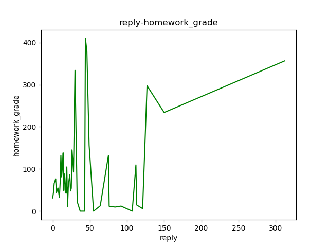
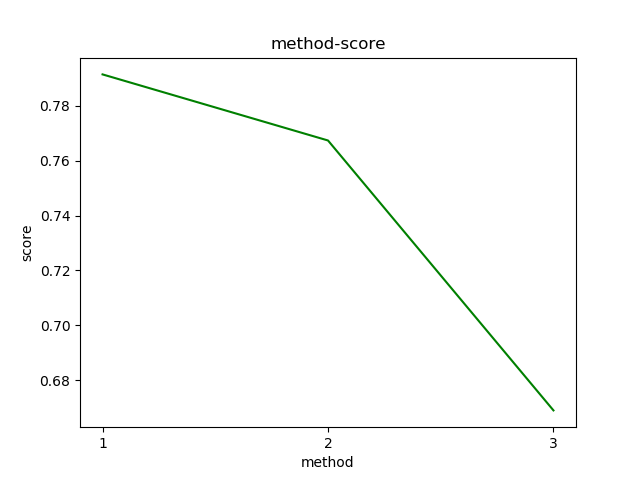
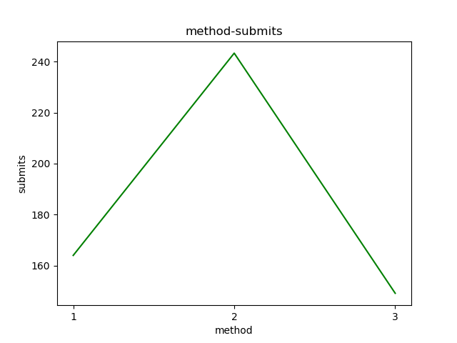

1.是否用户信息越完善的用户，更有可能完成这门课程。
    利用个人信息进行评分，每完成一项加一分，共1——4分。
    根据每个分数段的学生查询对应的学生成绩，并求出相应的及格率、优秀率、不及格率和无成绩率。
    
    
    
    
    根据分析，个人信息越完善，得到优秀的比例越高
    个人信息越完善，得到不及格的比例越低
    个人信息越完善，及格率越高
    个人信息完善与否与无成绩关系不大且无成绩人数占比最低

2.用户活跃程度与成绩的关系
	i. 发帖主题数
	ii. 发表帖子的质量（被赞次数、帖子总计回复）
	iii. 回帖数（参与讨论的次数）
   以确定是否老师可以通过引导学生积极发帖，来提高学生的学习兴趣。
   
   大致可以认为在发帖区活跃的学生成绩更好。
   我们分别分析了学生的发帖数量、回复数量、评论数量、总数量、点赞数量与学生的讨论分数、测试分数、作业分数、考试分数、最终分数、分数等级之间的关系。
   针对每组分析，我们用了两种方式。
   
   第一种是直接用每条学生的数据分析，比如发帖数量和最终成绩的关系，可以看出来大部分学生的发帖数量是很少的，而且成绩差的学生非常多。但是从比例上可以大致看出，在发帖数量稍多的情况下，如4、5、6次发帖的学生，测试成绩高的人数占比是比0次发帖的人数占比大的。经过计算，发帖数量与测试成绩的相关系数是0.12，所以发帖数量与测试成绩是有一定正比关系的。

   第一种分析方式虽然可以清楚的看到学生的人数情况，但是分析结果不够直观，大部分学生都处于成绩差而且发帖少的状态。因此我们又使用了另一种方法，对每个操作次数的学生成绩取平均值，得到两者之间的关系。
   
   如回复数量和作业成绩的关系，我们可以清楚的看到随着回复数量的增加，学生的成绩更好。
   针对这些情况我们分别做了分析，最终可以得到结论，发帖数量与最终成绩的关系最大，回复数量与作业成绩的关系最大。
   我们最后又使用了kmeans针对发帖数量、回复数量、评论数量、总数量、点赞数量五个特征对学生进行聚类，期望使用这五个特征预测学生最后成绩等级。然而结果并不理想，聚类结果与原始数据计算的nmi系数只有0.09，说明这五个并不能完全决定学生的成绩等级，因此讨论区的操作仅仅能作为学生成绩的一小部分参考，并不能大程度上决定学生的成绩。
   
   
3.选课人数随时间的变化趋势
     帮助老师决定从什么时候结束课程的导论部分，开始讲授重点。
    
    
    
    
    
    
    
    
    
    
    一般在开课前两周左右选课人数会先逐渐上升到达一个峰值，然后会下降至一个稳定值
    在期末考试附近的时间段会出现一个选课小峰值，初步推测是学生希望通过网课来学习平时掌握不好的内容
    
    
4.对于用户的作业，有系统评分、学生互评等等的评分方式。
     分析是否不同的评分方式对学生的积极性(参与人数、得分)造成影响

我们对学生作业提交次数、最后成绩与批改方法之间的关系进行了分析。由于分数这一指标针对每次作业都不一样，我们使用得分除以满分作为指标。
图中可以看出，老师批改最后得到的成绩最高，系统评分学生提交的次数最多。

5.一般需要多久推出一次课程？
    根据时间统计出每门课程选课人数和总人数的变化情况

6.？课程结课时间设置为多久更合适。是否测验、作业等越多越好？
