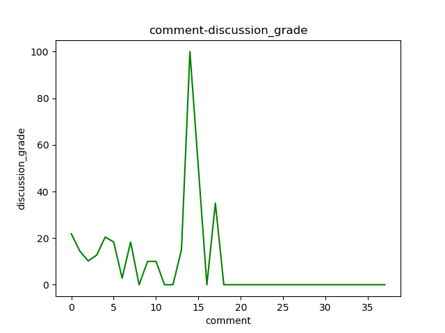

1.是否用户信息越完善的用户，更有可能完成这门课程。
    根据分析，个人信息越完善，得到优秀的比例越高
    个人信息越完善，得到不及格的比例越低
    个人信息越完善，及格率越高
    个人信息完善与否与无成绩关系不大且无成绩人数占比最低

2.用户活跃程度与成绩的关系
	i. 发帖主题数
	ii. 发表帖子的质量（被赞次数、帖子总计回复）
	iii. 回帖数（参与讨论的次数）
   以确定是否老师可以通过引导学生积极发帖，来提高学生的学习兴趣。

3.选课人数随时间的变化趋势
     帮助老师决定从什么时候结束课程的导论部分，开始讲授重点。

4.对于用户的作业，有系统评分、学生互评等等的评分方式。
     分析是否不同的评分方式对学生的积极性(参与人数、得分)造成影响

5.一般需要多久推出一次课程？
      一般在开课前两周左右选课人数会先逐渐上升到达一个峰值，然后会下降至一个稳定值
      在期末考试附近的时间段会出现一个选课小峰值，初步推测是学生希望通过网课来学习平时掌握不好的内容

6.？课程结课时间设置为多久更合适。是否测验、作业等越多越好？
